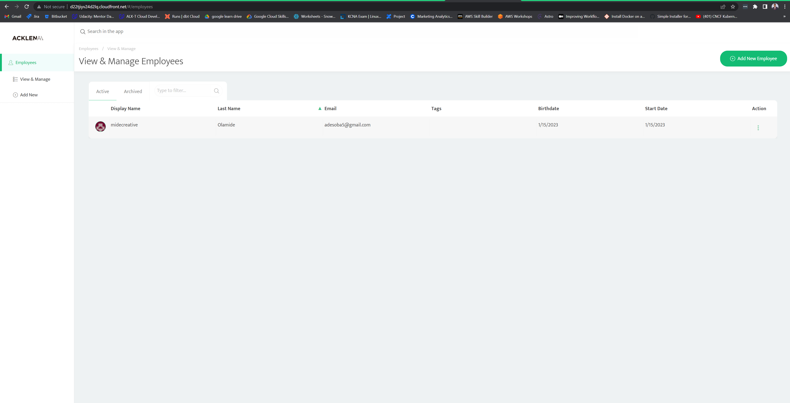
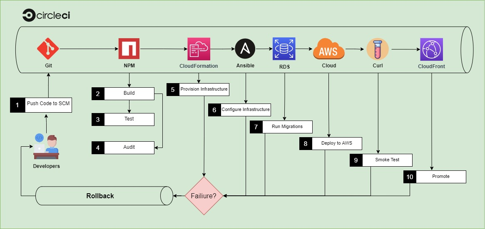
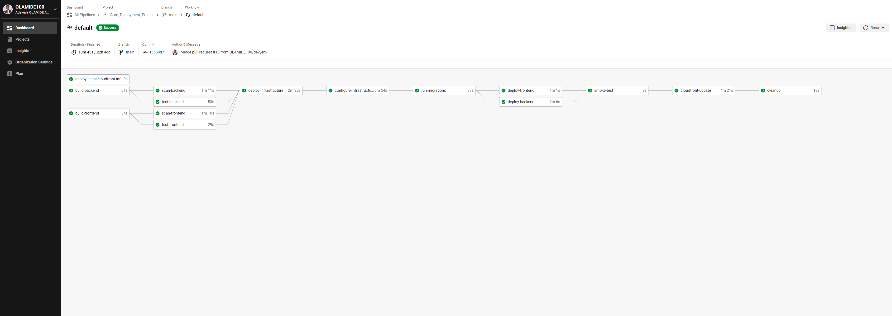

#
<h1 align="center">Udacity Advanced Cloud DevOps </h1>  

<!-- Adding Status Badges circleci Template
# Template:

# Example:

# Example for specific branch:

<PROJECT_NAME> - Your project’s name. Example: circleci-docs
<ORG_NAME> - The organization or user name the project in question belongs to
<VCS> - your VCS provider (gh for “github” and bb for BitBucket)
<LINK> - The link you want the status badge to go to when clicked (example: the pipeline overview page)
Optional: an API token (to create badges for private projects)
-->

<h3 align="center">Build CI/CD Pipelines, Monitoring & Logging Give Your Application Auto-Deploy Superpowers UdaPeople<i>(Cloud-Based Software)</i></h3>  
  

# 

 <a rel="Udacity" href="./2-udacity-passed.jpg">

## Table Of Contents
📌 [Udapeople](#udapeople)

📌 [Prerequisites](#prerequisites)

📌 [Tools](#tools)

📌 [Files](#files)

📌 [Project_Review](#project_review)

📌 [License](#license)

<h3 align="center">UdaPeople</h3>   

  

  A CI-CD pipeline for a client/server TypeScript project 
hosted on AWS EC2 and CloudFront and monitored with Prometheus, 
with Slack and E-mail notifications used for alerts. "<small><i>the fictional "UdaPeople" Product is  (Cloud-Based Software) Product,  a revolutionary concept in Human Resources which promises to help small businesses care better for their most valuable resource: their people."</i></small>

<h3 align="center">UdaPeople Pipeline</h3>   

  

## Prerequisites

🪡 [Nodejs 13](https://nodejs.org/en/) 

🪡 [Docker](https://www.docker.com/) 

🪡 [GitHub account](https://github.com/) 

🪡 [CircleCi account](https://circleci.com/) 

🪡 [AWS account](https://aws.amazon.com/) 

🪡 [kvdb api bucket](https://kvdb.io/) 

## Tools

🧵 [Circle CI](https://www.circleci.com) - Cloud-based CI/CD service 

🧵 [Amazon AWS](https://aws.amazon.com/)- Cloud services 

🧵 [AWS CLI](https://aws.amazon.com/cli/) - Command-line tool for AWS 

🧵 [CloudFormation](https://aws.amazon.com/cloudformation/) - Infrastrcuture as code 

🧵 [Ansible](https://www.ansible.com/) - Configuration management tool 

🧵 [Prometheus](https://prometheus.io/) - Monitoring tool 
#
<h2 align="center">Project Submission</h2>  

  
    
## Files
🗂️ [.circleci](./.circleci)

🗂️ [.cloudformation](./.circleci/cloudformation)

🗂️ [.ansible](./.circleci/ansible)

🗂️ [backend](./backend)

🗂️ [frontend](./frontend)

🗂️ [util](./util)

🗂️ [.gitignore](./.gitignore)

🗂️ [Screenshots](./screenshots/)

🗂️ [presentation.pdf](./Presentation.pdf)

🗂️ [urls.txt](./urls.txt)

🗂️ [README.md](./README.md)

🗂️ [LICENSE.md](./LICENSE.md) 

## Project_Review

https://review.udacity.com/#!/reviews/3915432

## License  

<!-- small  This work is licensed under a <a rel="license" href="http://creativecommons.org/licenses/by-nc-nd/4.0/">Creative Commons Attribution-NonCommercial-NoDerivatives 4.0 International License</a>. -->

 
